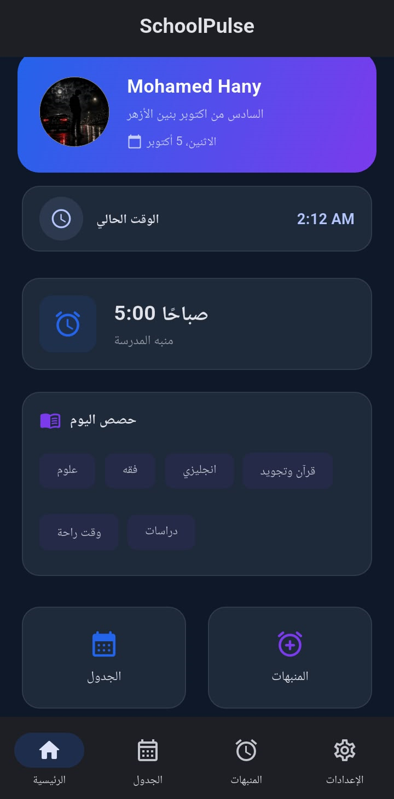
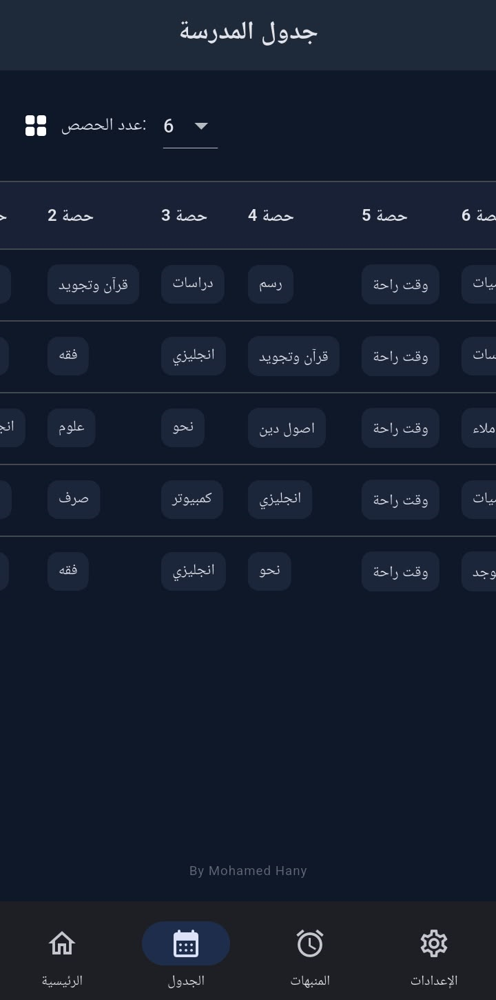
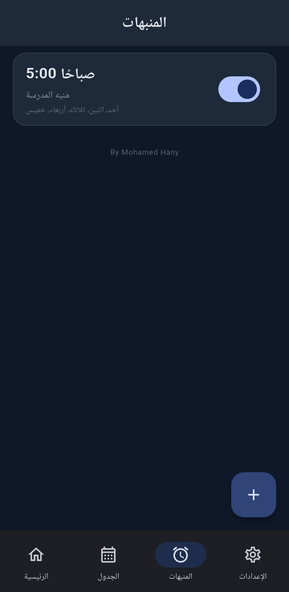
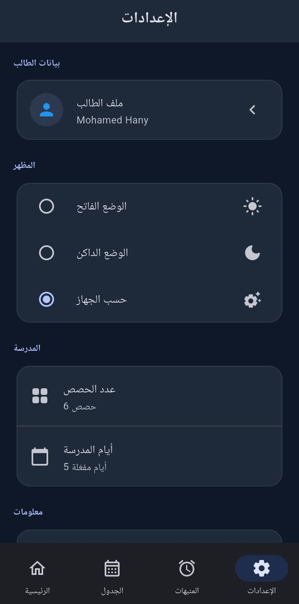

<div align="center">


# SchoolPulse

### 🎓 Your Smart School Assistant

**Organize your timetable, set real alarms, and receive smart notifications — 100% offline.**

[](https://flutter.dev)
[](https://dart.dev)
[](https://www.android.com)
[](https://kotlinlang.org)
[](https://github.com/MoTechOrbit/SchoolPulse/blob/main/LICENSE)

[Features](#-features) • [Installation](#-installation) • [Screenshots](#-screenshots) • [Developer](#-developer)

</div>

---

## 📱 Overview

**SchoolPulse** is a school assistant app designed for students. It works **fully offline** and helps them:

- Organize their weekly school timetable.
- Set real daily alarms that work even when the app is closed.
- Receive smart notifications that include the **full day's timetable** when an alarm fires.

All data is stored **locally on the device** — no account, no server, no Firebase.

---

## ✨ Features

### 📅 Flexible Timetable
- **Customizable** number of periods per day (from 1 to 10).
- Support for **7 days** with the ability to enable/disable any day.
- Each period has: subject, teacher, classroom, and notes.

### ⏰ Real Alarms
- Work even when:
  - The app is closed.
  - Swiped from Recent Apps.
  - The phone is locked.
- Automatic rescheduling after:
  - Device reboot.
  - Time or timezone change.
  - App update.

### 🔔 Timetable-Linked Alarms (Flagship Feature)
- When creating an alarm, you can enable: **"Show timetable in notification"**.
- When the alarm fires, the app reads the **day's timetable** from local storage.
- The notification shows smart content:

```
SchoolPulse
Good morning, Mohamed!
School is starting soon.
Today's schedule:
1. Math
2. Arabic
3. English
4. Science
5. History
6. Sports
```

### 🎵 Custom Sounds
- Choose from multiple built-in ringtones.
- Preview any sound before saving.
- Looping playback until the user stops it.

### 📢 Advanced Local Notifications
- Work in all states: app open, background, closed, or phone locked.
- Full Android 13+ and 14+ permission management.
- Separate notification channels.

### 🌙 Modern UI
- Fully **Material 3**.
- Two modes: **Light** and **Dark** (or system).
- Responsive design for all screen sizes.
- Simple, professional animations.

### 🔒 Complete Privacy
- ✅ No login required.
- ✅ No user account.
- ✅ No server or backend.
- ✅ No Firebase.
- ✅ No network requests.
- ✅ All data stored locally on device.

---

## 🖼️ Screenshots

<div align="center">

| Home | Timetable | Alarms | Settings |
|:----:|:---------:|:------:|:--------:|
|  |  |  |  |

| Setup Wizard | Ringing Screen | Dark Mode | About Developer |
|:------------:|:--------------:|:---------:|:---------------:|
|  |  |  |  |

</div>

---

## 🛠️ Tech Stack

### Framework
- **Flutter 3.47+** with **Dart 3.13+**
- **Material 3** design

### State Management
- **Provider** — single system only.

### Local Storage
- **SharedPreferences** — storing data as JSON.
- **path_provider** — for saving student photos.

### Notifications & Alarms
- **flutter_local_notifications** — local notifications.
- **android_alarm_manager_plus** — system-level scheduling.
- **timezone** + **flutter_timezone** — proper timezone handling.
- **Kotlin + ForegroundService** — looping sound playback.
- **MediaPlayer** with `AudioAttributes.USAGE_ALARM` — real alarm sound behavior.

### Additional Tools
- **image_picker** — picking student photo.
- **permission_handler** — permission management.
- **url_launcher** — opening phone dialer.
- **intl** — date formatting.
- **uuid** — alarm ID generation.

---

## 🏗️ Architecture

The project follows **Clean Architecture** with clear separation of concerns:

```
lib/
├── main.dart                          # Entry point
├── app.dart                           # Providers setup
│
├── core/                              # Shared systems
│   ├── constants/                     # Constants
│   ├── theme/                         # Themes
│   ├── utils/                         # Utilities
│   └── services/                      # System services
│       ├── notification_service.dart
│       ├── alarm_service.dart
│       └── alarm_native_channel.dart
│
├── models/                            # Data models
│   ├── student_model.dart
│   ├── timetable_model.dart
│   └── alarm_model.dart
│
├── data/                              # Data layer
│   ├── local/                         # Local storage
│   └── repositories/                  # Repositories
│
├── features/                          # UI features
│   ├── home/
│   ├── setup/
│   ├── timetable/
│   ├── alarms/
│   └── settings/
│
└── widgets/                           # Shared widgets

android/app/src/main/kotlin/com/example/school_pulse/
├── MainActivity.kt                    # Android entry point
├── AlarmMethodChannel.kt              # Flutter ↔ Android bridge
├── AlarmService.kt                    # Foreground service (sound)
├── AlarmReceiver.kt                   # Alarm receiver
├── AlarmScheduler.kt                  # AlarmManager scheduler
├── AlarmOverlayController.kt          # Overlay screen
└── AlarmPreviewPlayer.kt              # Sound preview
```

---

## 🚀 Installation

### Requirements
- Flutter SDK 3.47+
- Android SDK 24+
- JDK 17+

### Getting Started

```bash
# 1. Clone the repository
git clone https://github.com/username/school-pulse.git
cd school-pulse

# 2. Get dependencies
flutter pub get

# 3. Check environment
flutter doctor

# 4. Run
flutter run
```

### Build APK

```bash
# Debug
flutter build apk --debug

# Release (universal)
flutter build apk --release

# Release (per ABI)
flutter build apk --release --split-per-abi
```

**Output**: `build/app/outputs/flutter-apk/`

### Build AAB (for Google Play)

```bash
flutter build appbundle --release
```

**Output**: `build/app/outputs/bundle/release/app-release.aab`

---

## 🔐 Signing Setup (Release)

### 1. Create signing key

```bash
keytool -genkey -v -keystore my-release-key.jks \
  -keyalg RSA -keysize 2048 -validity 10000 \
  -alias my-key-alias
```

### 2. Create `android/key.properties`

```properties
storePassword=YOUR_PASSWORD
keyPassword=YOUR_PASSWORD
keyAlias=my-key-alias
storeFile=C:/path/to/my-release-key.jks
```

### 3. Link signing in `android/app/build.gradle.kts`

```kotlin
signingConfigs {
    create("release") {
        keyAlias = keystoreProperties["keyAlias"] as String?
        keyPassword = keystoreProperties["keyPassword"] as String?
        storeFile = keystoreProperties["storeFile"]?.let { file(it) }
        storePassword = keystoreProperties["storePassword"] as String?
    }
}
```

### 4. Build release

```bash
flutter build appbundle --release
```

> ⚠️ **Never commit `key.properties` or `my-release-key.jks` to GitHub.**

---

## 🎵 Adding Custom Sounds

1. Place an `.mp3` file in:
   ```
   android/app/src/main/res/raw/alarm_mySound.mp3
   ```

2. Add a label in `lib/features/alarms/widgets/alarm_form_sheet.dart`:
   ```dart
   static const Map<String, String> _soundLabels = {
     'alarm_default': 'Default',
     'alarm_school': 'School Alarm',
     'alarm_mySound': 'My Custom Sound',  // ← add here
   };
   ```

3. Rebuild:
   ```bash
   flutter clean
   flutter pub get
   flutter build apk --release
   ```

---

## 🔒 Required Android Permissions

| Permission | Purpose |
|-----------|---------|
| `POST_NOTIFICATIONS` | Send notifications (Android 13+) |
| `SCHEDULE_EXACT_ALARM` | Schedule precise alarms |
| `RECEIVE_BOOT_COMPLETED` | Reschedule after reboot |
| `WAKE_LOCK` | Wake device to show notification |
| `VIBRATE` | Vibration |
| `FOREGROUND_SERVICE` | Sound service |
| `SYSTEM_ALERT_WINDOW` | Show screen over other apps (optional) |

---

## ⚠️ Known Limitations

- **Android 12+**: Requires user to manually grant `SCHEDULE_EXACT_ALARM`.
- **Android 14+**: Requires `FOREGROUND_SERVICE_SPECIAL_USE`.
- **Some manufacturers** (Xiaomi, Huawei, Oppo, Vivo): may kill the app in background — adding to "protected apps" is recommended.
- **`flutter_timezone`**: still uses legacy KGP; may show a warning during build.

---

## 🗺️ Roadmap

- [x] Flexible timetable
- [x] Real alarms
- [x] Timetable-linked alarms
- [x] Custom sounds
- [x] Light & dark modes
- [x] Arabic language support
- [ ] iOS support
- [ ] Localization (Arabic/English)
- [ ] Attendance statistics
- [ ] Optional cloud sync

---

## 🤝 Contributing

The project is currently **closed to contributions**. For questions or suggestions:

- 📞 **Phone**: 01553308975 / 01553308947
- 💬 **Issues**: [GitHub Issues](https://github.com/username/school-pulse/issues)

---

## 📄 License

```
© 2026 Mohamed Hany. All rights reserved.
```

This project is **proprietary** and may not be copied, distributed, or modified without written permission from the developer.

---

## 👨‍💻 Developer

<div align="center">

**Mohamed Hany**

Flutter Developer

📞 01553308975 | 01553308947

© 2026 Mohamed Hany. All rights reserved.

</div>

---

<div align="center">

**⭐ If you like this project, don't forget to star it!**

</div>
